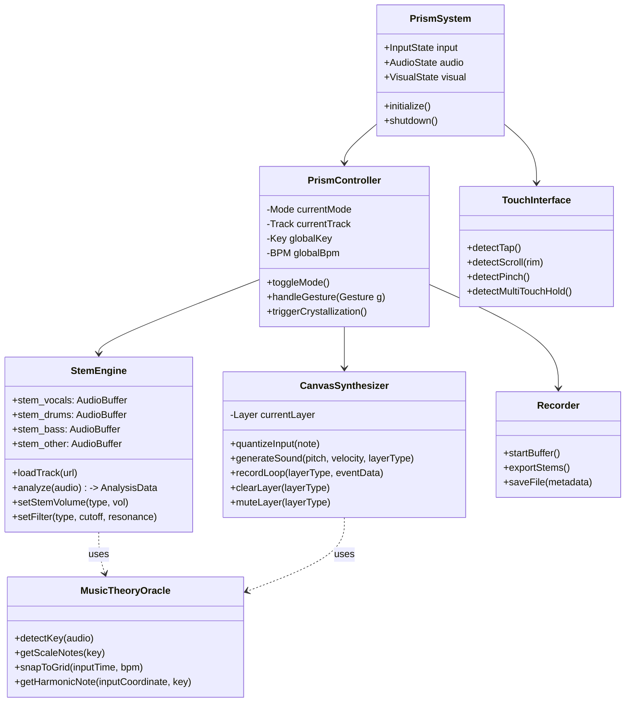

# Product Specification: The Prism (v1.0)
**Project Name:** The Prism (The Musical Prism)
**Version:** 1.0
**Type:** Soft-Hardware Integrated Instrument / Concept Design
**Status:** Ready for Development

---

## 1. 專案概觀 (Executive Summary)

### 1.1 核心概念
「The Prism」是一款概念性的數位樂器，旨在打破傳統樂理門檻。它透過「光譜折射」的隱喻，將現有的串流歌單（Input）拆解為不同的音樂元素（Stems），並允許使用者透過「畫布疊加」的方式，直覺地加入符合調性的新旋律。

### 1.2 目標受眾
具備音樂品味但缺乏深厚樂理基礎的「品味優先型」創作者。

### 1.3 核心價值主張
* **Intuition over Theory**: 以視覺隱喻（光、顏色、距離）取代樂理術語。
* **Harmonic Safety Net**: 自動調性鎖定，確保使用者的演奏永遠和諧。
* **Crystallization**: 將即興的混音與演奏瞬間封存為高品質音檔。

---

## 2. 系統架構 (System Architecture)

系統分為三個核心邏輯層：

1.  **Interaction Layer (Frontend / Firmware)**
    * 處理觸控玻璃介面的手勢輸入（Tap, Swipe, Pinch, Hold）。
    * 負責 LED 光效與流體視覺的回饋渲染。
2.  **Logic Layer (Middleware)**
    * **Music Theory Oracle**: 核心大腦，負責偵測調性並修正使用者輸入。
    * **State Machine**: 管理 Prism (萃取) 與 Canvas (創作) 模式切換。
3.  **Audio Engine (Backend / DSP)**
    * 整合 AI 音源分離技術 (Stem Separation)。
    * 即時合成器 (Synthesizer) 與音訊混音。

---

## 3. 系統邏輯模型 (Domain Logic)

### 3.1 類別圖 (Class Diagram)
定義系統核心模組與資料流向。



### 3.2 狀態機圖 (State Machine Diagram)
描述使用者在不同模式間的流轉邏輯。

``` demo_code
stateDiagram-v2
    [*] --> Idle
    Idle --> Loading : Import Playlist
    Loading --> PrismMode : Analysis Complete

    state PrismMode {
        %% 萃取模式
        [*] --> AdjustingMix
        AdjustingMix --> Filtering : Pinch/Spread Gesture
        AdjustingMix --> SelectingStem : Drag Center
        SelectingStem --> AdjustingMix
    }

    state CanvasMode {
        %% 創作模式
        [*] --> Layering
        Layering --> RecordingLoop : Hold Gesture
        Layering --> MutingLayer : Tap Inner Circles
        Layering --> SoloingLayer : Long Press Inner Circle
    }

    %% 模式切換
    PrismMode --> CanvasMode : Double Tap Center
    CanvasMode --> PrismMode : Double Tap Center

    state Crystallization {
        %% 輸出流程
        [*] --> BufferCapture
        BufferCapture --> FileGeneration
        FileGeneration --> ExportSuccess
    }

    PrismMode --> Crystallization : 3-Finger Hold (3s)
    CanvasMode --> Crystallization : 3-Finger Hold (3s)
    ExportSuccess --> PrismMode
```

### 3.3 互動時序圖 (Sequence Diagram)
情境：使用者在創作模式下，滑動手指加入一段旋律。

``` demo_codesequenceDiagram
    participant User
    participant UI as TouchInterface
    participant Ctrl as PrismController
    participant Oracle as MusicTheoryOracle
    participant Synth as CanvasSynthesizer
    participant Audio as AudioOutput

    Note over User, Audio: Scenario: User adds a melody in Canvas Mode

    User->>UI: Swipe on Outer Rim (Vector, Speed)
    UI->>Ctrl: InputEvent(Type: Swipe, Coord: [x,y], Velocity: 0.8)

    rect rgb(40, 40, 50)
        Note right of Ctrl: The "Safety Net" Algorithm
        Ctrl->>Oracle: getHarmonicNote(Coord, CurrentKey)
        Oracle-->>Ctrl: Return Note(Pitch: C#4, Scale: A_Minor)
        Ctrl->>Oracle: snapToGrid(Timestamp, BPM)
        Oracle-->>Ctrl: Return QuantizedTimestamp
    end

    Ctrl->>Synth: triggerNote(Note, Velocity, Layer="Melody")
    Synth->>Audio: Play Sound (Synthesized Saxophone)

    Note over UI, Audio: Visual Feedback
    Ctrl->>UI: RenderLightParticle(Color: Orange, Pos: [x,y])
```

## 4. UI/UX 視覺與操作規範 (Visual & Interaction Spec)
## 4.1 硬體介面定義
Form Factor: 30cm 直徑圓盤底座，上方覆蓋透明觸控玻璃。

Display: 玻璃下方為全彩高解析度 LED 矩陣或 OLED 顯示層。

Controls: 玻璃表面（多點觸控） + 實體外環旋鈕（帶有阻尼感）。

## 4.2 狀態與視覺回饋表

| 系統狀態 (State) | 中心光球 (Core) | 外環畫布 (Orbit) | 邊框 (Rim) | 關鍵手勢與功能 |
|-----------------|----------------|-----------------|-----------|---------------|
| Idle | 熄滅 (Dim) | 呼吸燈 (Breathing) | 關閉 | 觸摸喚醒系統。 |
| Prism Mode(萃取/策展) | 亮白色 (White)<br>動態流體 (Fluid) | 顯示 EQ 頻譜波紋 | 顯示播放進度 | Pinch/Spread: 改變濾波器頻寬 (Filter Width)。<br>Drag Center: 上下左右選擇不同樂器 Stem。 |
| Canvas Mode(創作/疊加) | 變暗 (Dimmed)<br>顯示同心圓軌道 | 彩色亮點 (Color)<br>顯示可用音階點 | 顯示音色選單 | Tap: 點擊演奏單音。<br>Swipe: 繪製旋律線。<br>Hold: 錄製 Loop。<br>Tap Inner Ring: 靜音特定軌道。 |
| Crystallization(錄音/輸出) | 極亮 (Flash)<br>凝結成幾何晶體 | 快速旋轉收縮 | 進度條填滿 | 3-Finger Hold: 觸發錄音與檔案輸出。 |